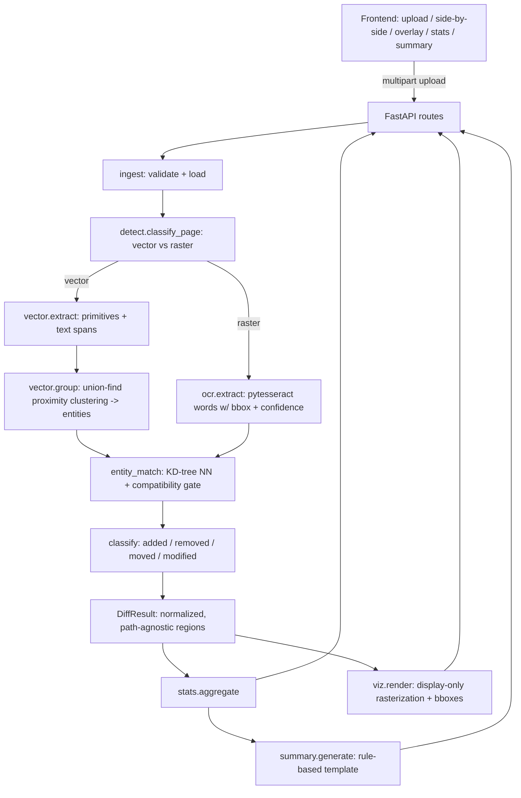

# CaD-Track Architecture

Git-style change tracking for CAD drawings: given two versions (v1/v2) of the
same drawing as PDF or image, CaD-Track reports what was **added, removed,
moved, or modified** — with an annotated visualization, statistics, and a
rule-based natural-language summary.

## Why not pixel diffing

A previous attempt rasterized both PDFs and compared pixels along X/Y. Any
global shift or scale difference between exports (different DPI, margins,
page size) made the *entire* sheet read as changed. CaD-Track deliberately
contains **no pixel-comparison algorithm**. Instead it extracts the
*structured content* of each drawing and diffs that:

- **Vector PDFs** (native CAD exports): real geometry primitives
  (`page.get_drawings()`) and positioned text spans (`page.get_text("dict")`)
  via PyMuPDF — exact, noise-free.
- **Raster PDFs / images** (scans, flattened exports): text and annotations
  recovered with Tesseract OCR (`image_to_data`, per-word bbox + confidence).
  Pure geometry changes are **not evaluated** for raster inputs — a
  documented, surfaced limitation rather than a silent wrong answer.

All coordinates are normalized to `[0, 1]` against each page's own size, so
two files with different page dimensions are directly comparable and a global
shift/scale cannot masquerade as content change.

## Component flow

## Comparison modes

| Input A | Input B | Mode | What is diffed |
|---|---|---|---|
| vector | vector | `geometry+text` | grouped geometry entities + text spans |
| vector | raster | `text-only` | vector side's exact text vs OCR text |
| raster | raster | `text-only` | OCR text vs OCR text |

When any side is raster, comparing geometry would report everything as
removed (one side has none), so both sides are reduced to text entities and
the result carries an explanatory note. If one side yields drastically fewer
readable words (low-resolution scan), a warning is attached to the result and
the summary.

## Diff engine

1. **Extraction** produces `Entity` objects: `GEOMETRY` (bbox, centroid,
   primitive-kind histogram) or `TEXT` (bbox, centroid, string, confidence).
2. **Grouping** (vector only): primitives whose endpoints touch within a
   tolerance are clustered with union-find over a spatial grid — one cluster
   approximates one drawn symbol/feature. (A learned upgrade path is
   GAT-CADNet-style graph-attention symbol spotting, arXiv 2201.00625.)
3. **Matching**: KD-tree nearest-neighbor over normalized centroids within a
   search radius, gated by compatibility (string similarity for text —
   relaxed when positions coincide, so `R10 -> R15` is a *modification*, not
   remove+add; primitive-histogram + size similarity for geometry). Greedy
   one-to-one assignment by combined distance/similarity cost.
4. **Classification**: unmatched old → `removed`; unmatched new → `added`;
   matched with centroid displacement beyond tolerance → `moved`; matched
   with changed content → `modified` (text changes carry `'old' -> 'new'`
   detail).

## Statistics & summary

- Counts per change type; per-region area, bbox, and 3×3-grid location
  bucket (`upper-left` … `center` … `lower-right`).
- Total changed area = **union** of region bboxes (coordinate-grid sweep, no
  double counting of overlaps).
- Summary is pure string templating (no LLM): overall sentence with a
  severity word (minor < 2 % < moderate < 10 % < significant of page area),
  top-3 region sentences phrased per change type and location, a closing
  area percentage, plus mode notes/warnings.

## Visualization

Pages are rasterized **only for display** (the diff is already decided on
entities). Modes: change-overlay on v2, side-by-side (v1 boxes at old
positions, v2 at new), and plain originals. Colors: green added, red
removed, amber moved, blue modified.

## Reference material

- GAT-CADNet (arXiv 2201.00625) — graph-attention panoptic symbol spotting
  on CAD primitives; the future upgrade for entity grouping.
- eDOCr (github.com/javvi51/eDOCr) — keras-OCR pipeline for GD&T/dimension
  extraction; a heavier, pluggable alternative to the pytesseract OCR path.
- engineering-drawing-extractor (github.com/Bakkopi/engineering-drawing-extractor)
  — title-block isolation pattern mirrored by `vector/titleblock.py`.

## Out of scope (v1)

- Learned symbol spotting (no training data); proximity clustering instead.
- eDOCr/keras-OCR integration (TensorFlow dependency).
- Geometry diffing of raster inputs; any pixel/CV-based comparison.
- Multi-page reorder-aware matching (page 1 vs page 1 only).
- Auth / multi-user persistence (in-memory job store).
